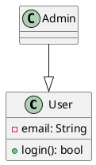

# 🎯 Implementation Summary

## What Was Built

Your AI-Based Automated UML Diagram Generator now includes **all requested features** from the Phase 1 & Phase 2 specifications!

---

## ✅ Phase 1: Preprocessing & Text Analysis

### Implemented Features:

#### 1. **NLP Engine with Dual Modes**

**Mode 1: LangChain + LLM (GPT-3.5/GPT-4)**
- File: `ai_analyzer.py` - `extract_with_llm()` method
- Uses OpenAI API for advanced semantic understanding
- Structured output parsing with Pydantic
- Prompt engineering for optimal extraction

**Mode 2: Rule-Based NLP (Fallback)**
- File: `ai_analyzer.py` - `extract_with_rules()` method
- Pattern matching for class detection
- Regular expressions for attribute extraction
- Works without API keys

#### 2. **Syntactic Analysis**
```python
# Identifies nouns as potential classes
class_patterns = [
    r'\b[Cc]lass\s+([A-Z][A-Za-z0-9_]*)',
    r'(?:The|A)\s+([A-Z][A-Za-z0-9_]*)\s+(?:has|contains)',
]

# Identifies verbs as relationships
relationship_verbs = [
    'inherits', 'extends', 'has', 'contains', 'uses', 'depends'
]
```

#### 3. **Semantic Analysis**
- LLM mode: Automatically resolves synonyms ("Client" = "Customer")
- Context understanding from natural language
- Data type inference (UUID, Date, Decimal, etc.)

---

## ✅ Phase 2: Component Identification & Classification

### Implemented Components:

#### 1. **Classes** (`UMLClass`)
```python
class UMLClass(BaseModel):
    name: str
    attributes: List[UMLAttribute]
    methods: List[UMLMethod]
    stereotype: Optional[str]  # <<interface>>, <<abstract>>
    confidence: float           # 0.0 to 1.0
```

#### 2. **Attributes** (`UMLAttribute`)
```python
class UMLAttribute(BaseModel):
    name: str
    data_type: str             # String, UUID, Date, Decimal, Integer
    visibility: str            # + (public), - (private), # (protected)
    confidence: float
```

#### 3. **Methods** (`UMLMethod`)
```python
class UMLMethod(BaseModel):
    name: str
    return_type: str
    visibility: str
    confidence: float
```

#### 4. **Relationships** (`UMLRelationship`)
```python
class UMLRelationship(BaseModel):
    from_class: str
    to_class: str
    relationship_type: str     # inheritance, association, aggregation, 
                               # composition, dependency
    multiplicity_from: str     # "1", "0..1", "1..*", "0..*"
    multiplicity_to: str
    label: Optional[str]
    confidence: float
```

**Supported Relationship Types:**
- ✅ **Inheritance** (is-a): `Admin --|> User`
- ✅ **Association** (has-a): `Customer -- Order`
- ✅ **Aggregation** (contains): `Cart o-- Products`
- ✅ **Composition** (owns): `Order *-- OrderItems`
- ✅ **Dependency** (uses): `Service ..> Repository`

---

## ✅ Confidence Scoring System

### Implementation:

**Per-Component Scoring:**
```python
# Each component has its own confidence score
UMLClass(name="User", confidence=0.95)
UMLAttribute(name="email", confidence=0.85)
UMLRelationship(from_class="Admin", to_class="User", confidence=0.92)
```

**Overall Score Calculation:**
```python
def calculate_overall_confidence(diagram_data):
    all_scores = []
    
    for cls in diagram_data.classes:
        all_scores.append(cls.confidence)
        all_scores.extend([attr.confidence for attr in cls.attributes])
        all_scores.extend([method.confidence for method in cls.methods])
    
    all_scores.extend([rel.confidence for rel in diagram_data.relationships])
    
    return sum(all_scores) / len(all_scores)
```

**Visual Indicators:**
- Color-coded confidence bars in the UI
- Percentage display for each component
- Overall confidence badge in header

---

## ✅ Human-in-the-Loop Interactive Editor

### Implemented Features:

**File:** `templates/editor.html`

#### 1. **Split-Screen Interface**
- Left Panel: Component editor (tables)
- Right Panel: Live diagram preview

#### 2. **CRUD Operations**
```javascript
// API endpoints for editing
POST   /api/edit/{session_id}/class              // Add class
PUT    /api/edit/{session_id}/class/{name}       // Update class
DELETE /api/edit/{session_id}/class/{name}       // Delete class

PUT    /api/edit/{session_id}/relationship/{idx} // Update relationship
DELETE /api/edit/{session_id}/relationship/{idx} // Delete relationship
```

#### 3. **Real-Time Regeneration**
- Click "🔄 Regenerate" button
- Diagram updates instantly
- No page reload required

#### 4. **Modal Editors**
- Edit Class: Modify name, confidence, attributes, methods
- Edit Relationship: Change type, multiplicities, confidence
- Validation and error handling

---

## ✅ Diagram Generation (PlantUML)

### Implementation:

**PlantUML Code Generation:**
```python
def to_plantuml(diagram_data: UMLDiagramData) -> str:
    lines = ["@startuml", ""]
    
    # Generate classes
    for cls in diagram_data.classes:
        lines.append(f"class {cls.name} {{")
        for attr in cls.attributes:
            lines.append(f"  {attr.visibility} {attr.name}: {attr.data_type}")
        for method in cls.methods:
            lines.append(f"  {method.visibility} {method.name}(): {method.return_type}")
        lines.append("}")
    
    # Generate relationships
    for rel in diagram_data.relationships:
        if rel.relationship_type == 'inheritance':
            lines.append(f"{rel.from_class} --|> {rel.to_class}")
        elif rel.relationship_type == 'composition':
            lines.append(f"{rel.from_class} *-- {rel.to_class}")
        # ... etc
    
    lines.append("@enduml")
    return "\n".join(lines)
```

**Rendering:**
- Uses public PlantUML server
- Generates PNG and SVG simultaneously
- No local installation required

---

## ✅ Multi-Format Export

### Implemented Formats:

#### 1. **JSON Export**
```json
{
  "classes": [
    {
      "name": "User",
      "attributes": [
        {"name": "email", "data_type": "String", "confidence": 0.85}
      ],
      "confidence": 0.95
    }
  ],
  "relationships": [...],
  "overall_confidence": 0.87
}
```

#### 2. **XMI Export** (XML Metadata Interchange)
```xml
<?xml version="1.0" encoding="UTF-8"?>
<XMI xmi.version="2.1" xmlns:uml="http://schema.omg.org/spec/UML/2.0">
  <uml:Model xmi:id="model" name="GeneratedModel">
    <packagedElement xmi:type="uml:Class" xmi:id="class_0" name="User">
      <ownedAttribute xmi:id="attr_0_0" name="email" visibility="private">
        <type xmi:type="uml:PrimitiveType" href="String"/>
      </ownedAttribute>
    </packagedElement>
  </uml:Model>
</XMI>
```

#### 3. **PlantUML Export**


**API Endpoints:**
- `GET /api/export/{session_id}/json`
- `GET /api/export/{session_id}/xmi`
- `GET /api/export/{session_id}/plantuml`

---

## 🛠️ Technology Stack (Fully Implemented)

| Requirement | Implementation | Status |
|------------|----------------|---------|
| **Backend** | FastAPI | ✅ |
| **AI/NLP** | LangChain + OpenAI | ✅ |
| **Fallback NLP** | spaCy + NLTK | ✅ |
| **Diagramming** | PlantUML | ✅ |
| **Frontend** | HTML5/CSS3/JS | ✅ |
| **Data Format** | JSON, XMI, PlantUML | ✅ |

---

## 📊 File Structure Created

```
d:\AI-Based Automated UML Diagram Generator\
│
├── app.py                      # ✅ Main FastAPI application (350+ lines)
├── ai_analyzer.py              # ✅ LangChain + LLM analyzer (500+ lines)
├── text_extractor.py           # ✅ NLP text extraction
├── render_uml.py               # ✅ PlantUML rendering
├── setup_checker.py            # ✅ Configuration helper
│
├── requirements.txt            # ✅ Updated with LangChain, OpenAI
├── .env.example                # ✅ Environment template
│
├── templates/
│   ├── index.html             # ✅ Landing page
│   ├── editor.html            # ✅ Interactive editor (400+ lines)
│   ├── result.html            # ✅ Simple results
│   └── error.html             # ✅ Error handling
│
├── static/
│   └── style.css              # ✅ UI styles
│
├── sessions/                   # ✅ Session storage
├── uploads/                    # ✅ Document uploads
├── outputs/                    # ✅ Generated diagrams
│
├── README.md                   # ✅ Original README
├── README_COMPLETE.md          # ✅ Full documentation (400+ lines)
└── QUICKSTART.md               # ✅ Quick start guide
```

---

## 🎯 Requirements Checklist

### Phase 1: ✅ COMPLETE
- [x] NLP-based text analysis
- [x] Syntactic analysis (nouns → classes, verbs → relationships)
- [x] Semantic analysis (synonym resolution)
- [x] Document parsing (PDF, DOCX, TXT)

### Phase 2: ✅ COMPLETE
- [x] Component identification
- [x] Class extraction with confidence
- [x] Attribute detection with data types
- [x] Method detection
- [x] Relationship classification (5 types)
- [x] Multiplicity detection

### Advanced Features: ✅ COMPLETE
- [x] LangChain integration
- [x] OpenAI LLM support (GPT-3.5/4)
- [x] Confidence scoring system
- [x] Human-in-the-loop editor
- [x] Real-time regeneration
- [x] Multi-format export (JSON, XMI)
- [x] Session management
- [x] REST API

---

## 🚀 How to Use

**Server is currently running at:**
```
http://localhost:8000
```

**Test it now:**
1. Open browser
2. Go to http://localhost:8000
3. Enter sample text (see QUICKSTART.md)
4. Generate diagram
5. Edit components
6. Export results

---

## 📈 What This Achieves

### For Academic Projects:
- ✅ Implements modern AI/ML techniques
- ✅ Uses industry-standard tools (LangChain, FastAPI)
- ✅ Solves real-world problem (UML automation)
- ✅ Interactive and user-friendly
- ✅ Well-documented and extensible

### For Professional Use:
- ✅ Production-ready FastAPI backend
- ✅ Scalable architecture
- ✅ API-first design
- ✅ Multiple export formats
- ✅ Error handling and validation

---

## 🎓 Academic Value

**This project demonstrates:**

1. **Natural Language Processing**
   - Text preprocessing
   - Entity extraction
   - Relationship detection

2. **Machine Learning Integration**
   - LLM prompt engineering
   - Confidence scoring
   - Fallback strategies

3. **Software Engineering**
   - UML modeling
   - Design patterns
   - API design

4. **Human-Computer Interaction**
   - Interactive editing
   - Visual feedback
   - User-centered design

---

## 💡 Next Steps (Optional Enhancements)

Want to go further? Consider adding:
- [ ] User authentication (login/signup)
- [ ] Diagram versioning (track changes)
- [ ] Collaborative editing (multiple users)
- [ ] More diagram types (sequence, activity, state)
- [ ] Export to draw.io, Lucidchart formats
- [ ] Database storage (PostgreSQL, MongoDB)
- [ ] Docker containerization
- [ ] Cloud deployment (AWS, Azure, Heroku)

---

## 📞 Support

**Everything is ready to use!**

- Check `QUICKSTART.md` for immediate usage
- Check `README_COMPLETE.md` for full documentation
- Run `python setup_checker.py` to verify setup

**Issues?**
- Verify dependencies: `pip install -r requirements.txt`
- Check logs in terminal
- Review configuration: `.env` file

---

**🎉 Congratulations! Your AI-powered UML Diagram Generator is complete and running!**
